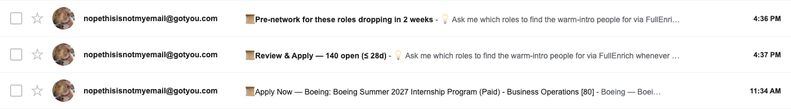
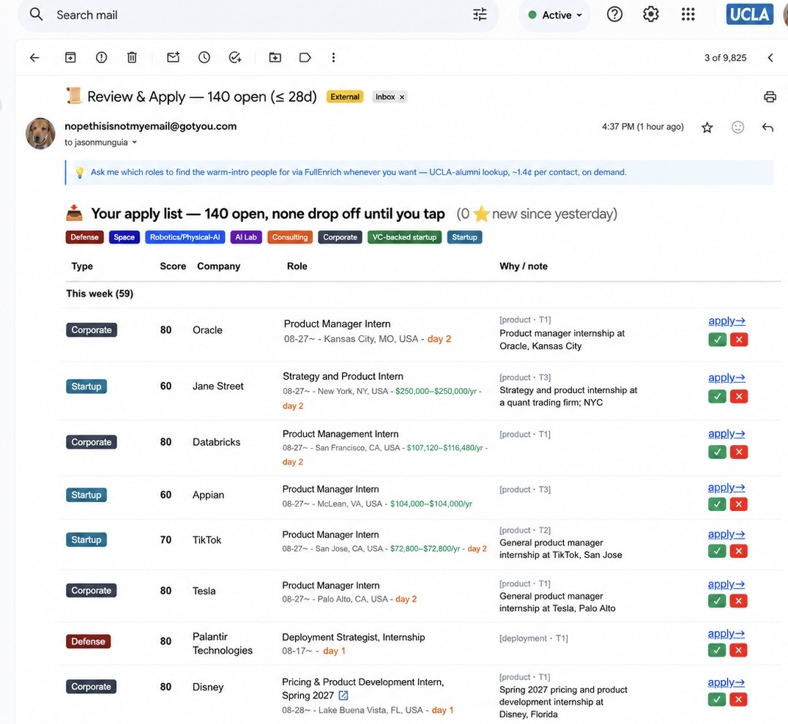

# open-internship-radar

### Your inbox

Three emails, and only three: a pre-network heads-up before postings go live, the daily
apply queue, and instant alerts for anything urgent.



### Your apply list

Every row already passed the full pipeline — role family, T1–T3 company tier, and a
liveness check — before it earned a line. Tap ✓/✗ to train the matching, `apply→` to go.



An always-on job radar you run yourself. It polls ~170 sources (config/sources.yaml — 171 today) every two hours, scores what it
finds against role families and company caliber, and emails you three things: **what opens soon**
(so you can network before the posting exists), **what is open now** (as a queue you work to zero,
not a feed you skim), and **anything urgent, within the hour**.

Built by [Jason Munguia](https://github.com/jasonmunguia). Apache-2.0 — free to use, fork and build on, **with credit**.


It runs on **your own LLM subscription** — no API keys, no per-token cost, no vendor account. The
deterministic parts run free in GitHub Actions whether your laptop is open or not.

**Setup: 30–60 minutes.** Most of that is deciding what you actually want, which is the part worth
your time.

**Have a coding agent? Paste it this single instruction and it can do the rest:**
> Read `METHODOLOGY.md`, then `CLAUDE.md`, then `AGENT_ONBOARDING.md`, then run
> `bash install.sh` and bring me online per the onboarding doc. Treat unedited example
> config as unfinished setup, and end with a real run I can see.

---

## Why this exists

Two things move an early-career outcome more than anything else you control: **applying in the
first days a posting is live**, and **a referral**. Competitive roles review on a rolling basis and
fill before their stated deadline — the deadline is marketing.

Noticing that a req exists, on the day it exists, across hundreds of employers, is a task a person
loses to a machine. Writing the application is not. So this system does only the first part, and
does it well, and stays out of the rest.

> **Read [`METHODOLOGY.md`](METHODOLOGY.md) before you configure anything.** It explains *why*
> each decision was made — including the ones that were wrong first. It is written to be handed
> to your coding agent so it can adapt the system rather than just run it.

---

## What you get

**Three emails, each with a job**

- **Pre-network** — programs opening in the next ~14 days, with a pre-filtered people search per
  company. Repeats daily until you mark it done, because a heads-up shown once on a busy morning
  is a heads-up that never happened.
- **Apply queue** — everything open you have not applied to, grouped Today / This week / Last week
  / This month. Tap a link and it never appears again. Do not tap it and it never disappears — it
  accrues a visible day counter instead.
  - **✓ / ✗ buttons** (green/red, next to apply→) are taste verdicts, not queue actions: logged
    to `data/feedback.jsonl`, never to `applied.jsonl`. **✗** hides the row from tomorrow on (a
    tap is a tap); **✓** marks it 👍 and keeps it until you apply. Mis-tap? The confirmation page
    has a flip link — the last tap wins. Once ≥10 verdicts span ≥7 days, the nightly
    `feedback_patterns` joint analyzes them (with web search) and the digest shows a "What your
    taps say" section — **proposals only**; tell your agent to apply any of them, nothing edits
    `profile.yaml` on its own.
  - **Pay** shows in green in the row sub-line when the board publishes it (Lever/Ashby/speedrun
    do; Greenhouse/Workday list APIs don't) — blank means unpublished, not broken. The gray
    `[cluster · tier · keywords]` line is why the row matched, from the system's own scoring —
    a mis-scored row should look wrong there at a glance.
- **Burning alert** — anything above threshold within one poll cycle, after verifying the posting
  is still live.

**A fourth email, and the only way the radar's taste changes.** The three above push work at
you; this one pulls correction back.

Once your taps have accumulated (≥10 verdicts spanning ≥7 days), a weekly **learning
check-in** emails what the system thinks it has learned — **rejections first**, because a ✗
is the correction signal while a ✓ only confirms what already ships. Each pattern carries
its evidence count and the single config change it would suggest.

Then it waits. **Reply in plain English** — "stop showing me insurance", "no unpaid roles" —
and your reply is read back over IMAP, quoted text stripped, and fed into every future
pattern run *weighted above anything the system inferred on its own*. Until you reply it
sends one follow-up per **calendar day** (not per 24 elapsed hours, or a check-in sent in
the evening silently skips a day). Replying is the only thing that stops it.

Two properties worth knowing before trusting it:

- **Proposals only, by design.** Nothing here edits `profile.yaml`. Do not add that:
  inbound email is spoofable, so a parse-and-apply path hands a config-write primitive to
  anyone able to forge a message to the mailbox.
- **An IMAP outage withholds the nudge instead of sending it blind.** If the inbox cannot
  be read, the system cannot know whether you replied — and nagging someone who already
  answered is worse than a quiet day.

*Success looks like:* the nightly's `learning_loop` stage always printing one of `weekly
check-in sent` / `awaiting reply…` / `follow-up #N sent` / `reply received … ingested` —
never silence — and `data/feedback_replies.jsonl` growing over time. Empty after weeks of
check-ins means the loop is emailing into the void.

**Warm intros (optional, the banner in every email points here).** The radar's two levers are
applying early and applying with a referral; the emails handle the first, this handles the second.
The play: before applying, find someone the hiring company already trusts who is one hop from
you — the highest-yield version is alumni of your school working there. An enrichment tool
does this in one query. [FullEnrich](https://fullenrich.com) is the one this workflow was built
against: person search filtered by school + current company + title, then contact enrichment
(verified work email, sometimes mobile) at roughly a cent or two per contact — searching is
free, you pay only to enrich the person you actually intend to message. Apollo or Clay run the
same play. None of this is wired into the pipeline on purpose: enrichment costs money per
contact, so it stays a deliberate, per-role ask to your agent ("find me warm-intro people for
the Stripe APM role"), never an automatic burn across every row of the queue.

**A scorer that grades the role and the company, not you.** It does not model your resume. That is
deliberate: scoring fit against one resume steers the whole funnel toward roles that resume
already fits. The system widens; you narrow at application time.

**Company tiering from public signals.** Audience size, headcount, and capital raised, taking the
best of the three — so a well-funded 40-person startup with no audience still surfaces.

---

## Architecture in one picture

```
GitHub Actions (every 2h, no laptop)        Your machine (daily + nightly)
├─ 127 direct ATS APIs                      ├─ 06:00 digest, retried hourly to 18:20
├─ 25 community job-list repos              │   └─ never sends degraded: any failed LLM
├─ VC portfolio boards                      │      pass defers (no send-anyway backstop)
├─ (see config/sources.yaml)                └─ 02:10 deep pass
├─ watch pages (no-API employers)               ├─ funding history
├─ SEC funding filings                          ├─ company tier backfill (scraper)
└─ score → burning alert if urgent              ├─ resolve what the scraper could not
                                                ├─ open-web discovery
                                                ├─ refresh the release calendar (LLM + web)
                                                └─ fetch JD text for every tapped row
```

**Deterministic spine, LLM at the joints.** Fetching, parsing, scoring, and delivery are plain
code — same input, same output, debuggable, free. A model is invoked at exactly six registered joints (`radar/joints.py` — enforced by
`tests/test_joints.py`) where the alternative would be a heuristic that is wrong. Full reasoning in `METHODOLOGY.md` §2.

---

## Setup

Follow [`SETUP.md`](SETUP.md). The short version:

1. Clone; `bash install.sh` (installs requirements + Scrapling, ships the skills and
   the mailer, verifies every dependency in `DEPENDENCIES.md`)
2. `cp config/person.example.yaml config/person.yaml` — who you are, where mail goes
3. `cp config/profile.example.yaml config/profile.yaml` — **the file that matters.** Role
   families, eligibility gates, tier thresholds
4. Edit `config/sources.yaml` — ships with a strong default set
5. Push to GitHub; Actions starts polling
6. Install the launchd/cron jobs from `docs/`
7. Optional: deploy `api/a.js` to Vercel for tap-to-clear links

**Do the calibration run before going live.** Score ~20 organisations you already have an opinion
about and check the bands match your instinct. Twenty minutes, and it is the highest-value step in
the whole setup — untuned thresholds either flood you or hide everything.

---

## Retargeting it

Nothing here is specific to internships. Rewrite the role families and eligibility gates, repoint
the sources, re-tune the thresholds. `METHODOLOGY.md` §9 walks through it. The parts that transfer
are the architecture, the source-discovery method, and the failure catalogue; the parts that do
not are one person's patterns and thresholds for one market at one moment.

---

## Documentation

| File | What it is for |
|---|---|
| [`METHODOLOGY.md`](METHODOLOGY.md) | **Start here.** Why every decision was made, the failure catalogue, how to adapt it |
| [`SETUP.md`](SETUP.md) | Step-by-step install |
| [`TOOLS.md`](TOOLS.md) | Every tool, the job it does, the LLM joints, the failure modes |
| [`CLAUDE.md`](CLAUDE.md) | Operating doctrine for a coding agent working in this repo |
| [`AGENT_ONBOARDING.md`](AGENT_ONBOARDING.md) | How an agent brings a HUMAN online — the three jobs, the four questions |
| [`DEPENDENCIES.md`](DEPENDENCIES.md) | Every external tool: capability, what it is load-bearing for, where to get it |

## Honesty about maturity

Built and run by one person against one job market. The architecture and the failure catalogue are
the durable parts. The specific thresholds, patterns, and company lists are one set of judgments
and you should replace them with your own. Several components have run for days, not months.

Issues and PRs welcome, particularly source additions with a live probe result attached.

Apache-2.0 — free to use, fork and build on, **with credit**. Keep the `NOTICE` file.
